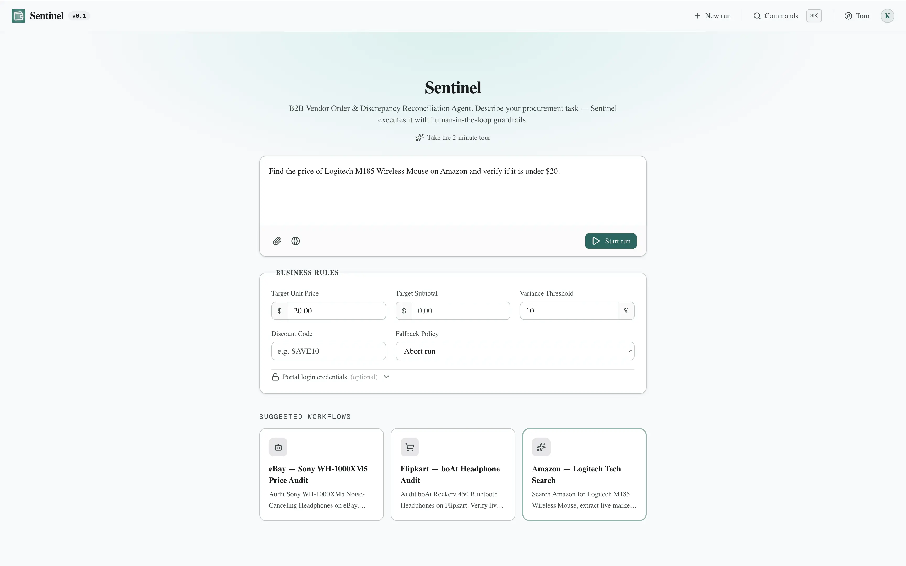
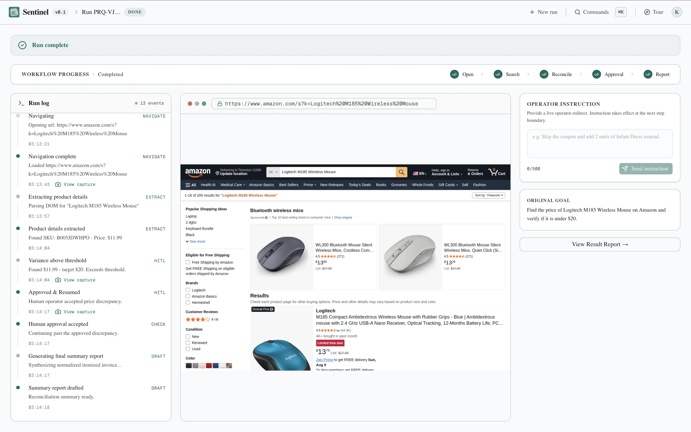
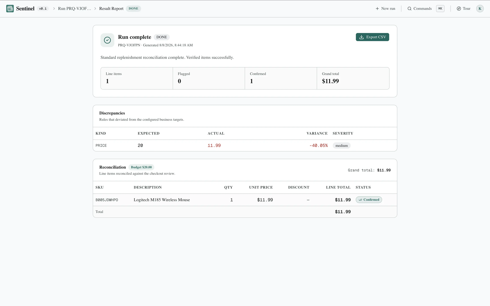

# Sentinel

**B2B Vendor Order & Discrepancy Reconciliation Agent**

Sentinel is an AI agent that executes B2B procurement workflows end-to-end. Give it a plain-English goal — what to buy, how many units, price ceilings, discount codes — and it navigates the vendor portal, builds the cart, validates every price and coupon against your business rules, and pauses for human approval on anything high-stakes. It drafts the final invoice summary for your review, but **never places the order itself**.

---

## Screenshots

### Goal Input
Describe your procurement task in plain English. Set price targets, variance thresholds, discount codes, and a fallback policy.



### Live Run
Watch the agent work step-by-step in real time. Every navigation, extraction, and validation is logged to a live timeline. Steer the agent at any point, or wait for it to surface a guardrail check.



### Report
When the run completes, a structured reconciliation report is ready. Review flagged discrepancies, human-confirmed items, and export the normalized invoice as a CSV.



---

## How it works

```
User describes goal
        │
        ▼
  Intent classifier  ──── conversational? ──► reply directly
  (Gemini Flash)     ──── capability query? ─► explain & example
        │
        └──── automation task ──►
                                │
                    Worker enqueued (BullMQ)
                                │
                                ▼
          ┌─────────────────────────────────┐
          │  LangGraph.js StateGraph        │
          │  plan → execute → extract       │
          │       → validate                │
          │            │                    │
          │    threshold crossed?           │
          │    ├─ yes ──► HITL_PENDING      │  ◄── Human: approve / override / abort
          │    └─ no  ──► auto-continue     │
          │                                 │
          │    coupon/field failure?        │
          │    └──► RECOVERING (fallback)   │
          │                                 │
          │    step error (≤2 replans)?     │
          │    └──► replan → retry          │
          │                                 │
          └────────────────┬────────────────┘
                           │
                     DRAFT_READY / DONE
                           │
                           ▼
               Reconciliation report (PostgreSQL)
               SSE event stream → live run UI
```

---

## Core capabilities

| Capability | Description |
|---|---|
| **Goal-driven navigation** | Parse any natural-language goal into a step plan; resolve direct storefront search URLs (eBay, Amazon, Flipkart, Target, Best Buy, Walmart, Myntra, Ajio) and navigate storefronts. |
| **Price validation** | Check every unit price against a target + variance threshold; auto-continue on small gaps. |
| **Human-in-the-loop** | Cross-threshold events surface a blocking approval modal — Approve & Continue, Override Target, or Abort. |
| **Live steering** | Operator sends a free-form instruction at any point; the agent applies it at its next step boundary without interrupting the current step. |
| **Coupon validation & recovery** | Apply discount codes, detect portal error messages, fall back to the configured policy without crashing. |
| **Multi-product comparison & spec sheets** | Extract side-by-side comparison spec sheets, star ratings, review counts, best pick recommendations, and direct product page links for multi-item research queries. |
| **Multi-channel pricing audit** | Compare price, discount, shipping, and margin across two or more stores; large gaps require human confirmation. |
| **Structured invoice & CSV export** | Itemized invoice rendered as a table with direct clickable product page links; one-click CSV export with proper escaping. |

---

## Architecture

The system is split into two deployable services that communicate over HTTP and SSE.

```
┌──────────────────────────────────────┐         ┌──────────────────────────────────────┐
│  Next.js frontend (this repo)        │         │  Worker service (worker/)            │
│                                      │  HTTP / │                                      │
│  /          Landing page             │   SSE   │  LangGraph.js StateGraph             │
│  /app       Goal input + rules       │ ◄──────►│  Playwright Stealth (HTTP/1.1)      │
│  /runs/:id  Live run + HITL modal    │         │  Gemini 2.5 Flash (+ fallbacks)      │
│  /runs/:id  /result  Report + CSV    │         │  Rule engine (variance / margin)     │
│                                      │         │  BullMQ job queue                    │
│  Thin Zod-validated API layer        │         │  Redis pub/sub + BLPOP HITL          │
└──────────────────────────────────────┘         └───────────────┬──────────────────────┘
                                                                 │
                                                 ┌───────────────▼──────────────────────┐
                                                 │  PostgreSQL  — runs, reports,        │
                                                 │               approvals, history     │
                                                 │  Redis       — job queue, run state, │
                                                 │               event pub/sub          │
                                                 └──────────────────────────────────────┘
```

**Why the split?**
Playwright keeps a browser alive for minutes and streams events continuously — serverless functions can't reliably host that. The frontend is stateless and declarative; all automation, LLM orchestration, and browser state live in the worker. The shared contract (domain types in `src/types/`) is the only seam between them.

---

## Tech stack

### Frontend (`/`)
| Layer | Choice |
|---|---|
| Framework | Next.js 16 (App Router, Turbopack) + React 19 |
| Language | TypeScript (strict) |
| Styling | Tailwind CSS v4 (CSS-first config) |
| UI primitives | shadcn/ui base-nova · Base UI · Lucide icons |
| Fonts | Geist Sans / Geist Mono |
| Server state | TanStack React Query v5 |
| Validation | Zod v4 |
| Animation | Motion |
| Command palette | cmdk |

### Worker (`worker/`)
| Layer | Choice |
|---|---|
| Runtime | Node.js + TypeScript |
| Agent orchestration | LangGraph.js `StateGraph` |
| Browser automation | Playwright 1.62 (Stealth mode, HTTP/1.1 protocol) |
| LLM | Gemini 2.5 Flash (primary) · OpenAI-compatible fallback via OpenRouter / Groq / Ollama |
| Job queue | BullMQ + Redis (ioredis) |
| Database ORM | Drizzle ORM + PostgreSQL |
| HTTP server | Express |

---

## Getting started

### Prerequisites
- Node.js 20+
- A running PostgreSQL instance (Neon, Supabase, or local)
- A running Redis instance (Upstash, Redis Cloud, or local)
- A Gemini API key ([Google AI Studio](https://aistudio.google.com) — free tier)

### Frontend

```bash
# Install dependencies
npm install

# Create a .env.local with the worker URL
echo "NEXT_PUBLIC_WORKER_URL=http://localhost:3001" > .env.local
echo "GEMINI_API_KEY=your_key_here" >> .env.local

# Start the dev server
npm run dev
```

Open [http://localhost:3000](http://localhost:3000).

### Worker

```bash
cd worker

# Install dependencies
npm install

# Install Playwright browsers
npx playwright install chromium

# Create a .env with your credentials
cat > .env << EOF
PORT=3001
DATABASE_URL=postgresql://...
REDIS_URL=redis://...
GEMINI_API_KEY=your_key_here
WORKER_CONCURRENCY=1
PLAYWRIGHT_HEADLESS=true
EOF

# Run database migrations (Drizzle)
npm run db:push   # or npm run db:migrate

# Start the worker dev server
npm run dev
```

---

## Environment variables

### Frontend
| Variable | Required | Description |
|---|---|---|
| `GEMINI_API_KEY` | ✅ | Used by the intent classifier (`POST /api/intent`) to route prompts |
| `NEXT_PUBLIC_WORKER_URL` | ✅ | Base URL of the running worker service |

### Worker
| Variable | Required | Description |
|---|---|---|
| `DATABASE_URL` | ✅ | PostgreSQL connection string |
| `REDIS_URL` | ✅ | Redis connection string |
| `GEMINI_API_KEY` | ✅ | Primary LLM for planning, extraction, and orchestration |
| `OPENROUTER_API_KEY` | ☑️ optional | LLM fallback via OpenRouter |
| `GEMINI_MODEL` | ☑️ optional | Override default model (e.g. `gemini-2.5-flash`) |
| `PORT` | ☑️ optional | HTTP port (default `3001`; Render uses `10000`) |
| `WORKER_CONCURRENCY` | ☑️ optional | Max concurrent Playwright runs (default `1`) |
| `PLAYWRIGHT_HEADLESS` | ☑️ optional | `true` in production, `false` for local debugging |

---

## Scripts

### Frontend
```bash
npm run dev     # Dev server with Turbopack
npm run build   # Production build + type check
npm run start   # Serve production build
npm run lint    # ESLint
```

### Worker
```bash
npm run dev     # Dev server with hot reload (tsx --watch)
npm run build   # TypeScript compile
npm run start   # Serve compiled build
npm run lint    # TypeScript type check (tsc --noEmit)
```

---

## Deployment

The frontend deploys to **Vercel** (or any Next.js-compatible host). The worker deploys to **Render**, **Railway**, or **Fly.io** — any platform that can run a persistent Node.js process with Docker support.

A `render.yaml` blueprint is included for one-click Render deployment of the worker:

```bash
# Update the repo URL in render.yaml, then:
# Render Dashboard → New + → Blueprint → select repo
```

Set the secret environment variables (`DATABASE_URL`, `REDIS_URL`, `GEMINI_API_KEY`) in the Render dashboard on first deploy — they are not committed to source.

> **Free-tier note:** The Render free tier spins down idle services after 15 minutes. Keep the worker alive with an external uptime monitor (e.g. UptimeRobot or cron-job.org) pinging `/health` every ~10 minutes.

---

## Project structure

```
sentinel/
├── src/                          # Next.js frontend
│   ├── app/
│   │   ├── page.tsx              # Landing page (/)
│   │   ├── app/page.tsx          # Goal input (/app)
│   │   ├── runs/[runId]/         # Live run screen
│   │   │   ├── page.tsx
│   │   │   └── result/page.tsx   # Reconciliation report
│   │   └── api/                  # Thin API routes (Zod-validated)
│   │       ├── intent/           # Intent classifier
│   │       ├── runs/             # Run management
│   │       └── wake/             # Worker keep-alive
│   ├── components/
│   │   ├── ui/                   # shadcn/ui base components
│   │   ├── onboarding/           # Tour overlay + steps
│   │   ├── screenshot-tabs.tsx   # Landing page tab switcher
│   │   ├── sentinel-navbar.tsx   # App-wide header
│   │   └── command-palette.tsx   # ⌘K command palette
│   ├── hooks/                    # useRunStream, useResolveHITL, …
│   ├── lib/                      # cn(), format helpers, API client
│   ├── server/                   # Server-only: Zod schemas, worker proxy
│   └── types/                    # Shared domain types (the contract)
│
├── worker/                       # Agent worker service
│   └── src/
│       ├── index.ts              # Express + BullMQ bootstrap
│       ├── routes/               # /runs, /runs/:id/stream, /resolve, /steer
│       ├── queue/jobs.ts         # BullMQ job → runGraph()
│       └── agent/
│           ├── graph/            # LangGraph.js StateGraph
│           │   ├── graph.ts      #   buildSentinelGraph()
│           │   ├── state.ts      #   SentinelState + reducers
│           │   ├── emit.ts       #   DB insert + Redis pub/sub
│           │   └── nodes/        #   plan · execute · extract · validate · hitl · replan · report
│           ├── actions/          # navigate · search · addToCart · coupon · fill · screenshot
│           ├── session/          # SessionManager (Playwright lifecycle)
│           ├── planner.ts        # LLM goal → PlanResult
│           ├── extractor.ts      # DOM → { product, confidence }
│           └── rule-engine.ts    # checkProduct / recheck (pure)
│
├── public/
│   ├── scrn1.webp               # Goal input screenshot
│   ├── scrn2.webp               # Live run screenshot
│   └── scrn3.webp               # Report screenshot
│
├── context/                      # Project documentation
│   ├── project_overview.md
│   ├── architecture.md
│   ├── ui_context.md
│   ├── code_standards.md
│   ├── decisions.md             # Architecture decision records (ADRs)
│   ├── acceptance_criteria.md
│   └── roadmap.md
│
├── render.yaml                  # Render deployment blueprint (worker)
└── docker-compose.yml           # Local dev: Postgres + Redis
```

---

## Domain types (the contract)

The types in `src/types/` are the shared wire contract between the frontend and worker. Changing them is a cross-service change — both sides must stay in sync.

| Type | Description |
|---|---|
| `GoalInput` | Natural-language goal + parsed business rules (target price, variance threshold, coupon, fallback policy) |
| `RunStatus` | `PARSED` → `NAVIGATING` → `EXTRACTING` → `CHECKING` → `HITL_PENDING` → `RESUME` → `FORM_FILLING` → `VALIDATING` → `RECOVERING` → `DRAFT_READY` → `DONE` / `ABORTED` / `FAILED` |
| `AgentEvent` | One streamed step: `{ step, status, title, detail, evidence?, at }` — step types: `NAVIGATE · SEARCH · EXTRACT · CHECK · HITL · FORM_FILL · VALIDATE · RECOVER · DRAFT · STEER` |
| `SteerInstruction` | Free-form operator redirect: `{ instruction }` — applied at the next step boundary |
| `Discrepancy` | `{ kind, expected, actual, variancePct, threshold, severity }` |
| `ApprovalRequest` | Blocking HITL gate: `{ id, runId, title, detail, discrepancies[] }` |
| `ApprovalResolution` | `"approve" \| "override" \| "abort"` + optional `overrideTarget` |
| `ChannelSnapshot` | Per-store comparison row: `{ channel, price, discount, shipping, computedMargin }` |
| `ComparisonItem` | Multi-product comparison row: `{ name, price, rating, reviewsCount, specs, isBestPick, verdict, url }` |
| `LineItem` | Invoice row: `{ sku, description, quantity, unitPrice, lineTotal, discounts, status, url }` |
| `ReconciliationReport` | Final report: `{ runId, generatedAt, items[], discrepancies[], channels[], comparison[], summary }` |

---

## Design system

Built on **shadcn/ui base-nova** with a custom teal-primary token palette. All styling uses semantic Tailwind tokens — no raw hex values, no inline CSS.

| Token | Value | Usage |
|---|---|---|
| `--primary` | `#00685f` | CTAs, active states, progress |
| `--background` | `#f7f9fb` | Page background |
| `--foreground` | `#191c1e` | Body text |
| `--card` | `#ffffff` | Cards, inputs |
| `--muted-foreground` | `#3d4947` | Secondary text, labels |
| `--border` | `#bcc9c6` | Hairline dividers |

Typography: **Geist Sans** for UI, **Geist Mono** for IDs, prices, and code.

---

## Onboarding tour

A guided spotlight tour walks new users through the goal input screen on their first visit. Re-trigger it at any time:
- **Keyboard:** press `⌘K` to open the command palette → "Take a tour"
- **Navbar:** click the **Tour** button in the top-right of the app screen

---

## Principles

- **Guardrail-first.** Any threshold-crossing action pauses the run and requires explicit human approval. The agent never places or submits the final order.
- **Explainable.** Every step is recorded as an event with evidence — a live run is a readable timeline, not a black box.
- **Recoverable.** Failures (bad coupon, missing field, LLM timeout) are logged and handled via a fallback policy; the run continues or aborts cleanly, never silently.
- **Structured output.** The final invoice is a normalized, machine-readable contract rendered as a table and exported as CSV.
- **Server-first.** Pages are Server Components by default; only interactive regions (`useRunStream`, HITL modal, steering control) are `"use client"`.

---

Built by [Kripanshu Singh](https://kripanshu.me) · [Portfolio](https://kripanshu.me) · [GitHub](https://github.com/kripanshu-singh)
